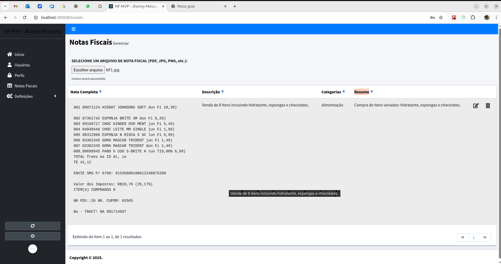
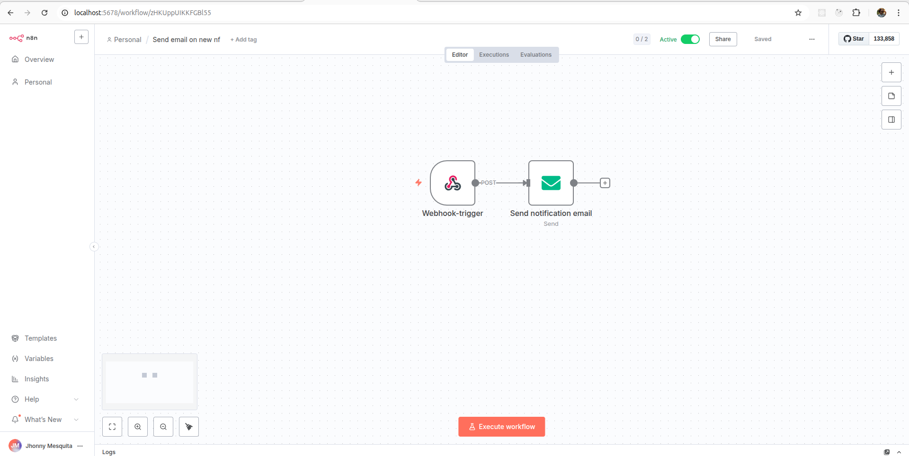

# NF MVP Jhonny Mesquita

**A fim de mostrar um pouco da minha experiência, desenvolvi o MVP um pouco mais sofisticado e ainda atendendo aos requisitos do desafio:**
 - 1 - API + Front
    - 1.1 - Um projeto Client-Server iniciado por mim, com dezenas de commits meus, para avaliar minha perícia.
 - 2 - Integração com IA
    - 2.1 - Utilizado o Tesseract, lib com IA opensource para processamento de imagem OCR (extração de texto).
    - 2.2 - Integração com OpenIA para categorizar, descrever e resumir a nota.
    

 - 3 - Automação com N8N - Enviando email via SMTP com gatilho via WebHook e autenticação via token
    


## Processa imagem e PDF de nota fiscal:
 - 1 - Logar no WebApp http://localhost:3000 com usuário  'admin' e senha '123'
 - 2 - Acessar menu 'Notas Fiscais' e clicar em 'SELECIONE UM ARQUIVO DE NOTA FISCAL (PDF, JPG, PNG, etc.):'
    - 2.1 - O arquivo será processado e serão extraídos os dados: Nota Completa, Descrição, Categorias, Resumo.
    - 2.2 - Dispara um gatilho webhook para o N8N, que dispara um email para jhonnyjks@gmail.com com todos os dados da nota. Altere esse email no N8N para testes.
 - 3 - Gestão de usuários no menu 'Usuários'.
    - 3.1 - Editar um usuário e atribuir a ele o perfil 'Cliente' para ter um cliente cadastrado e com acesso.
    - 3.2 - Todas as notas criadas ficarão relacionadas ao cliente criador.
 - 4 - Notas fiscais para testes
 ```
 public/NF1.jpg
 public/NF2.png
 ```

## Instruções de instalação
- **0** Requisitos para pleno funcionamento
  - 0.1 Ter o git e docker instalados;
  - 0.2 Setar a OPENAI_API_KEY em '.env.example' antes de rodar os comandos abaixo, necessário para OpenIA

- **1** Clonar este repositório e entrar no diretório que foi criado na clonagem:

  ```
  git clone https://github.com/jhonnyjks/nf-mvp.git
  cd nf-mvp
  ```
- **2** Buildar via docker (também serve para resetar estado):

  ```
  docker compose -f docker-compose.dev.yml build
  ```
- **3** Rodar via docker:

  ```
  docker compose -f docker-compose.dev.yml up
  ```
- **4** Instâncias que devem estar acessíveis em ambiente dev:

  - **Cliente (WebApp)** O App deve estar acessível em:
    - http://localhost:3000
    - Login: admin
    - Senha: 123
  - **API (Restful):** http://localhost:8000/api/auth/login
    - user: admin
    - pass: 123
  - **MySQLAdmin (Gestor WEB do Banco):** http://localhost:8080
    - user: root
    - pass: 123
  - **MariaDB (Banco de dados):** localhost:3307
    - user: root
    - pass: 123
  - **N8N:** http://localhost:5678
    - user: jhonnyjks@gmail.com
    - pass: 12345678aS
  - Utilizar IP bridge caso localhost não acesse: 172.17.0.1

- **5** Resetar banco de dados e projeto geral para estado inicial do repositório:

  ```
  docker compose -f docker-compose.dev.yml down -v
  ```

## Referências

Utilizar os comandos do InfyOm para gerar CRUDs: https://infyom.com/open-source/laravelgenerator/docs/generator-commands.html

- **Laravel + ReactJS Generator:** https://github.com/jhonnyjks/react-restful-client
- **Laravel 10:** https://laravel.com/docs/10.x
- **InfyOm Generator:** https://infyom.com/open-source/laravelgenerator/docs
